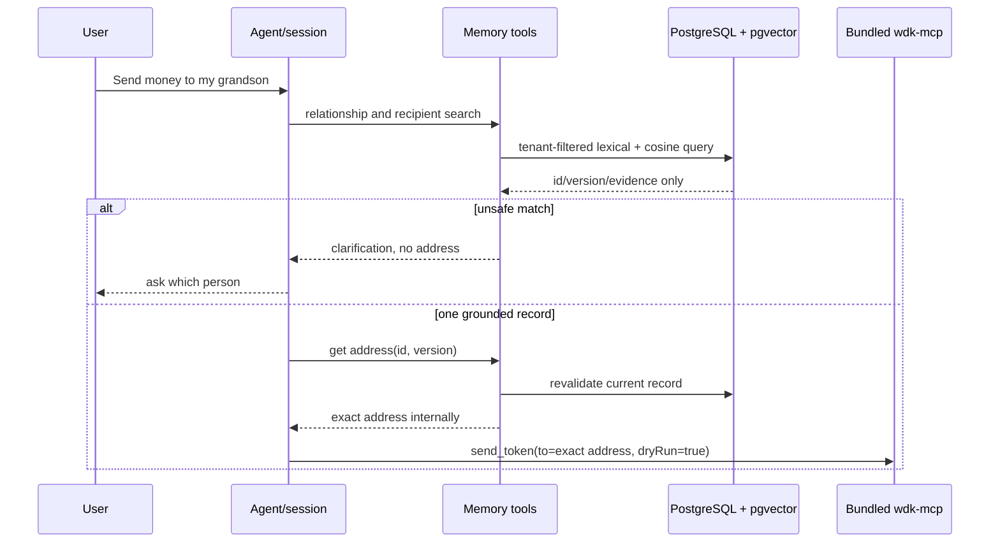

# WDK blockchain evidence boundary

## Recipient address memory boundary

Recipient references are durable application data in PostgreSQL 16 + pgvector,
not model context. `recipients` stores a versioned exact address payload with a
384D embedding of normalized name + description only; `user_memories` stores
confirmed relationship facts with a 384D fact embedding. The pinned local
model is `sentence-transformers/paraphrase-multilingual-MiniLM-L12-v2` via
Transformers.js, so retrieval needs no hosted embedding credential.

Every repository transaction applies the server-owned demo tenant UUID and
sets PostgreSQL RLS context under the restricted `recipient_app` role. Search
uses tenant-filtered lexical name boost plus cosine similarity and returns only
candidate metadata. A score threshold/margin or duplicate exact name produces
clarification, never an inferred address. The fixed `DEMO_USER_ID` is only a
hackathon identity seam; production must replace it with an authenticated
principal.

Writes use `stage_user_memory` followed by a session-bound, single-use,
five-minute confirmation. The draft is the only point at which an exact new
address can be shown for explicit user approval. Session inspection, candidate
search, embeddings, and release evidence redact or omit addresses. Before the
WDK preview and again before broadcast, the recipient ID/version/address are
revalidated; any mismatch clears both selection and pending approval.

This implementation proves the Track 1 integration boundary with the scoped
`@tetherto/wdk-cli@1.0.0-beta.2` package and direct
`@tetherto/wdk@1.0.0-beta.14` dependency. It requires Node.js `>=22.18.0`.
`wdk-mcp`, bundled by the scoped CLI package, is the only agent-facing wallet
boundary. The client starts its fixed installed executable through the official
MCP stdio transport; it does not parse CLI output or embed a toolkit.

The pinned CLI package requires its documented postinstall step to install the
wallet modules listed in its bundled configuration. `package.json` therefore
records npm approval only for the exact pinned CLI package and pins
`@tetherto/wdk-wallet-evm@1.0.0-beta.11` directly for the CLI's Sepolia
configuration. This is package installation, not wallet administration: it
never creates, imports, unlocks, funds, or deletes a wallet. The direct core
dependency is `@tetherto/wdk@1.0.0-beta.14`; the installed CLI beta.2 has its
own internal `@tetherto/wdk@1.0.0-beta.6` dependency, so the two versions must
not be treated as interchangeable runtime proof.

## Asset and network

The product asset is the registered Sepolia token slug `usdt` (test USD₮).
Sepolia ETH is gas only and is never a product-transfer fallback. The raw MCP context retains network, token,
recipient, decimal amount, `baseUnits`, wallet/index, `dryRun`, fee or gas
fields, result, error, transaction hash, and verification state. The agent and
HTTP layers use those fields to implement confirmation and session contracts;
this module intentionally makes none of those product decisions.

## Lifecycle and evidence

1. A human creates, backs up, funds, unlocks, and finally locks a dedicated
   limited-funds test wallet outside this repository, with a finite TTL.
2. `WdkMcpClient` launches the installed `wdk-mcp` with a small allowlisted
   environment, bounded handshake/call timeouts, stderr capture, and one-shot
   process lifecycle. A failed or uncertain call is closed and never retried.
3. Discovery captures raw tool names and schemas. Reads capture raw address,
   USD₮ balance, and history. History is explicitly classified as unavailable,
   stale, empty, or non-empty; unavailable and stale are never converted to
   empty.
4. A human-provided candidate invokes `send_token` with `dryRun: true` first.
   The preview evidence links recipient, token, amount, network, and fee while
   proving broadcast count zero.
5. Only a separately approved human operation can run the matching
   `dryRun: false` call. It is limited to one Sepolia USD₮ broadcast and must
   preserve the real hash plus explorer/history verification or its explicit
   unavailability. The repository does not run this command automatically.
   If a `dryRun: false` request times out or WDK returns `isError: true`, the
   client records a sanitized failure envelope with the original input, one
   attempted call, no hash, and `verification: uncertain`; it never retries.
6. The operator locks the wallet or lets its TTL expire, then captures a
   protected-call failure. No seed phrase, passphrase, private key, API key,
   credential, or configuration value is accepted in fixtures, errors, logs,
   or evidence.

## Safe manual harness

The normal test suite does not contact a wallet. The optional manual read and
preview harness requires `WDK_LIVE=1` plus an operator-supplied recipient and
small USD₮ amount; `WDK_TEST_TOKEN`, when present, must be exactly `usdt`. A broadcast is additionally gated by both
`WDK_ALLOW_BROADCAST=1` and `WDK_BROADCAST_APPROVED=1`; it is intentionally
not a CI command. Run artifacts in `tests/integration/wdk-fixtures/` are
templates, not a claim that a wallet, preview, or broadcast has occurred.

`npm run test:e2e:wdk-mcp` is a separately opt-in, wallet-free connectivity
check. It starts the bundled `wdk-mcp` through `WdkMcpClient`, completes stdio
initialization, discovers the Track 1 tools, calls only `get_networks` and
`get_token` for built-in Sepolia `usdt`, validates their raw MCP content shape,
and closes the process. It never creates, imports, unlocks, exports, deletes,
or funds a wallet, and never calls `send_token`.

These environment gates are harness controls, not daemon authorization. The
bundled CLI documentation states that an unlocked wallet can broadcast a valid
`dryRun: false` request without another daemon passphrase prompt, so the wallet
must be dedicated, limited-funds, same-user-access aware, and locked at the
end of the session.

Indexer configuration is never inherited from the process environment. The
installed CLI beta.2 reads the indexer base URL from its WDK CLI configuration,
so a host must configure that durable setting through the human-operated CLI
path. A host that has authorization to supply an indexer key may inject only
`WDK_INDEXER_API_KEY` explicitly into this client; the module never logs that
value and sanitizes authenticated URLs, query parameters, and authorization
tokens before evidence persistence.

## Deliberate Track 1 boundary

This project uses the ready-made CLI daemon and bundled `wdk-mcp` server. The
WDK MCP Toolkit is a different package for building a custom MCP server with
selected or custom tools, so it is intentionally out of scope. WDK agent
skills are instructional context, not this application's wallet boundary.
Neither x402 nor OpenClaw integration is part of this Developer 1 work unit.

## Failure and handoff contract

Failures retain their stage (`handshake`, `connection`, `discovery`, `call`,
`validation`, or `closure`), a sanitized message, and broadcast status.
Sensitive-shaped evidence is rejected before persistence. Fixtures use
`wdk-evidence/v1` and preserve raw WDK outcome shapes rather than a normalized
product contract. The application must treat fixture status and live evidence
as authoritative and must not infer a successful transaction from a preview,
unavailable indexer, or a missing hash.

Every fixture must contain `status`, recipient, token, amount, fee, and error
fields. The checked-in fixtures deliberately use `not-run`/blocked status and
null live values, so they cannot be mistaken for a real wallet result.
